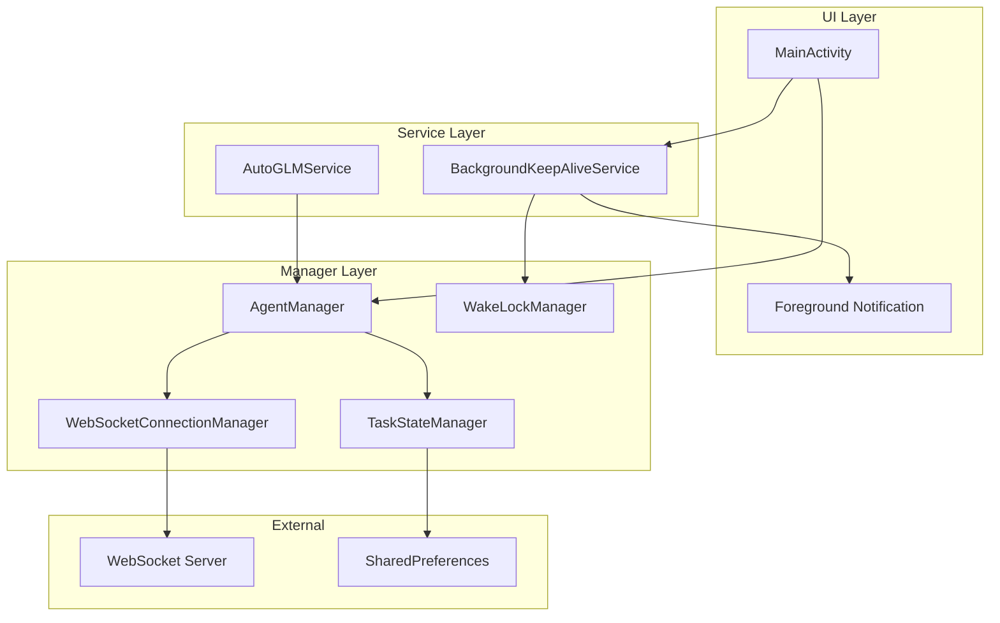
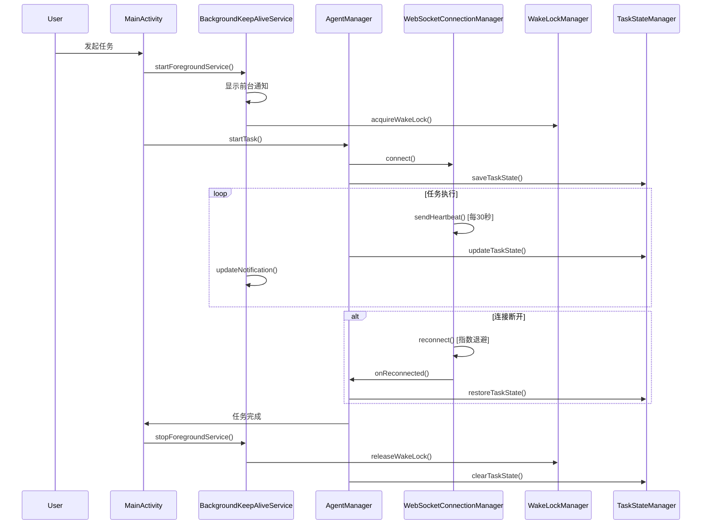

# Design Document: Background Keep-Alive

## Overview

本设计文档描述了AutoGLM Android应用的后台保活功能实现方案。该功能确保应用在执行跨应用操作时能够保持运行状态，维持与服务器的WebSocket连接，并在异常情况下能够恢复任务执行。

## Architecture

### 整体架构



### 组件交互流程



## Components and Interfaces

### 1. BackgroundKeepAliveService

负责管理前台服务和通知。

```java
public class BackgroundKeepAliveService extends Service {
    // 通知渠道ID
    private static final String CHANNEL_ID = "autoglm_task_channel";
    private static final int NOTIFICATION_ID = 1001;
    
    // 服务状态
    public enum ServiceState {
        IDLE, RUNNING, RECONNECTING, ERROR
    }
    
    // 公开接口
    void startForegroundTask(String taskDescription);
    void updateNotification(ServiceState state, String message);
    void stopForegroundTask();
    
    // 通知操作
    void showReconnectingNotification(int attemptCount, long nextRetryMs);
    void showErrorNotification(String errorMessage);
    void showTaskCompleteNotification(String result);
}
```

### 2. WebSocketConnectionManager

封装WebSocket连接管理，包含心跳和重连逻辑。

```java
public class WebSocketConnectionManager {
    // 配置常量
    private static final long HEARTBEAT_INTERVAL_MS = 30_000;
    private static final long HEARTBEAT_TIMEOUT_MS = 10_000;
    private static final int MAX_RECONNECT_ATTEMPTS = 5;
    private static final long[] RECONNECT_DELAYS_MS = {1000, 2000, 4000, 8000, 30000};
    
    // 连接状态
    public enum ConnectionState {
        DISCONNECTED, CONNECTING, CONNECTED, RECONNECTING
    }
    
    // 回调接口
    interface ConnectionCallback {
        void onConnected();
        void onDisconnected(String reason);
        void onReconnecting(int attempt, long nextRetryMs);
        void onReconnectFailed();
        void onMessage(String message);
        void onConnectionStateChanged(ConnectionState state);
    }
    
    // 公开接口
    void connect(String url, ConnectionCallback callback);
    void disconnect();
    void send(String message);
    ConnectionState getConnectionState();
    boolean isHealthy();
    
    // 内部方法
    private void startHeartbeat();
    private void stopHeartbeat();
    private void scheduleReconnect(int attempt);
    private void handleHeartbeatTimeout();
}
```

### 3. WakeLockManager

管理设备唤醒锁。

```java
public class WakeLockManager {
    // 配置
    private static final long MAX_WAKE_LOCK_DURATION_MS = 30 * 60 * 1000; // 30分钟
    private static final String WAKE_LOCK_TAG = "AutoGLM:TaskWakeLock";
    
    // 回调接口
    interface WakeLockCallback {
        void onWakeLockWarning(long heldDurationMs);
    }
    
    // 公开接口
    void acquire(WakeLockCallback callback);
    void release();
    boolean isHeld();
    long getHeldDuration();
}
```

### 4. TaskStateManager

管理任务状态的持久化和恢复。

```java
public class TaskStateManager {
    // 任务状态数据类
    public static class TaskState {
        String taskId;
        String taskPrompt;
        int currentStep;
        long startTime;
        long lastUpdateTime;
        String lastScreenshotBase64; // 可选，用于恢复
        Map<String, Object> additionalData;
    }
    
    // 公开接口
    void saveState(TaskState state);
    TaskState loadState();
    void clearState();
    boolean hasIncompleteTask();
    
    // 恢复相关
    interface TaskRecoveryCallback {
        void onTaskRecovered(TaskState state);
        void onTaskDiscarded();
    }
    void promptTaskRecovery(Context context, TaskRecoveryCallback callback);
}
```

## Data Models

### 任务状态模型

```java
public class TaskState implements Serializable {
    private String taskId;           // 任务唯一标识
    private String taskPrompt;       // 用户指令
    private int currentStep;         // 当前步骤
    private long startTime;          // 开始时间
    private long lastUpdateTime;     // 最后更新时间
    private int screenWidth;         // 屏幕宽度
    private int screenHeight;        // 屏幕高度
    private boolean isRunning;       // 是否正在运行
    
    // Getters and Setters
}
```

### 连接状态模型

```java
public class ConnectionStatus {
    private ConnectionState state;
    private long lastHeartbeatTime;
    private int reconnectAttempts;
    private String lastError;
    
    // Getters and Setters
}
```

### 通知数据模型

```java
public class NotificationData {
    private String title;
    private String content;
    private int progress;        // 0-100, -1表示不显示进度
    private boolean ongoing;
    private PendingIntent contentIntent;
    private PendingIntent stopIntent;
}
```


## Correctness Properties

*A property is a characteristic or behavior that should hold true across all valid executions of a system—essentially, a formal statement about what the system should do. Properties serve as the bridge between human-readable specifications and machine-verifiable correctness guarantees.*

### Property 1: Foreground Service Lifecycle Round-Trip

*For any* task that is started and then completed or stopped, the BackgroundKeepAliveService SHALL transition from foreground state to non-foreground state, and the notification SHALL be removed.

**Validates: Requirements 1.1, 1.3**

### Property 2: Wake Lock Lifecycle Consistency

*For any* task execution, the WakeLockManager SHALL acquire a wake lock when the task starts and release it when the task ends (completed, stopped, or failed), ensuring no wake lock leaks occur.

**Validates: Requirements 3.1, 3.2, 3.3**

### Property 3: Heartbeat Interval Consistency

*For any* running task with an active WebSocket connection, heartbeat messages SHALL be sent at intervals not exceeding 30 seconds (with reasonable tolerance for scheduling delays).

**Validates: Requirements 2.1**

### Property 4: Heartbeat Timeout Detection

*For any* heartbeat message sent, if no response is received within 10 seconds, the connection SHALL be marked as unhealthy.

**Validates: Requirements 2.2**

### Property 5: Exponential Backoff Reconnection

*For any* sequence of reconnection attempts, the delay between attempts SHALL follow the exponential backoff pattern: 1s, 2s, 4s, 8s, then capped at 30s for subsequent attempts.

**Validates: Requirements 2.3**

### Property 6: Task State Persistence Round-Trip

*For any* valid TaskState object, saving it to storage and then loading it back SHALL produce an equivalent TaskState object.

**Validates: Requirements 4.1, 4.4**

### Property 7: Task State Cleanup on Stop

*For any* task that is explicitly stopped by the user, the persisted task state SHALL be cleared (hasIncompleteTask() returns false).

**Validates: Requirements 4.5**

### Property 8: Connection Health Check on Resume

*For any* app transition from background to foreground while a task is running, the WebSocketConnectionManager SHALL verify connection health and initiate reconnection if the connection is unhealthy.

**Validates: Requirements 2.6**

## Error Handling

### WebSocket Connection Errors

| Error Type | Handling Strategy |
|------------|-------------------|
| Connection refused | Retry with exponential backoff |
| Connection timeout | Mark unhealthy, trigger reconnect |
| Server closed connection | Attempt immediate reconnect |
| Network unavailable | Pause task, wait for network, resume |
| Max retries exceeded | Notify user, pause task |

### Wake Lock Errors

| Error Type | Handling Strategy |
|------------|-------------------|
| Failed to acquire | Log error, continue without wake lock |
| Held too long (>30min) | Log warning, optionally notify user |
| Release failed | Force release in finally block |

### Task State Errors

| Error Type | Handling Strategy |
|------------|-------------------|
| Save failed | Retry once, log error if still fails |
| Load failed/corrupted | Clear state, start fresh |
| Version mismatch | Migrate or discard old state |

### Service Lifecycle Errors

| Error Type | Handling Strategy |
|------------|-------------------|
| Service killed by system | Return START_STICKY for restart |
| Notification channel missing | Create channel on demand |
| Foreground start failed | Fall back to background mode |

## Testing Strategy

### Unit Tests

单元测试用于验证各组件的独立功能：

1. **WebSocketConnectionManager Tests**
   - Test heartbeat scheduling starts/stops correctly
   - Test connection state transitions
   - Test message sending and receiving

2. **WakeLockManager Tests**
   - Test acquire/release lifecycle
   - Test duration tracking
   - Test warning callback trigger

3. **TaskStateManager Tests**
   - Test save/load operations
   - Test clear operation
   - Test hasIncompleteTask detection

4. **BackgroundKeepAliveService Tests**
   - Test notification creation
   - Test notification updates
   - Test service state management

### Property-Based Tests

属性测试用于验证系统的通用正确性属性，使用 **JUnit 5 + jqwik** 作为属性测试框架：

1. **Property 1: Foreground Service Lifecycle**
   - Generate random task sequences (start, stop, complete)
   - Verify service state consistency

2. **Property 5: Exponential Backoff**
   - Generate random reconnection attempt counts
   - Verify delay sequence follows pattern

3. **Property 6: Task State Round-Trip**
   - Generate random TaskState objects
   - Verify save/load produces equivalent objects

### Integration Tests

集成测试验证组件间的协作：

1. **End-to-End Task Flow**
   - Start task → Service starts → WebSocket connects → Task completes → Service stops

2. **Reconnection Flow**
   - Simulate connection drop → Verify reconnection → Verify task resume

3. **App Lifecycle Flow**
   - Background → Foreground → Verify connection health check

### Test Configuration

- Property tests: minimum 100 iterations per property
- Each property test must reference its design document property
- Tag format: **Feature: background-keep-alive, Property {number}: {property_text}**
